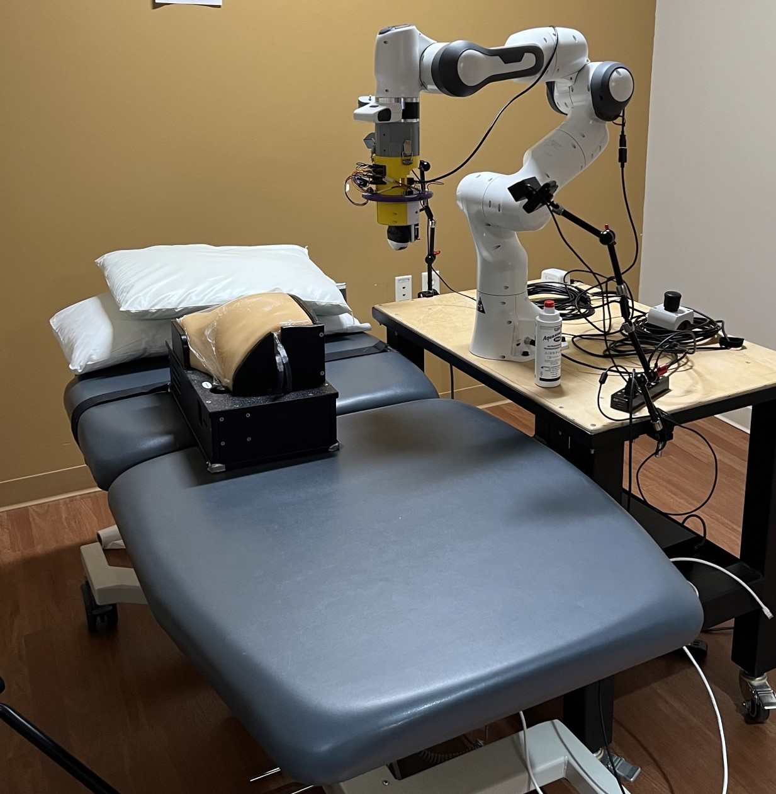
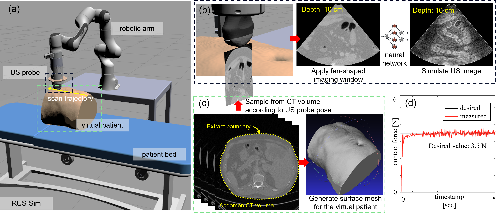

# RUS-Sim Visuals

Complete source code for RUS-Sim will come out soon.

RUS-Sim is a simulation developed specifically for robotic ultrasound imaging applications. The ultrasound robot platform (shown in the picture below) was previously developed in [Medical FUSIONLAB](https://wp.wpi.edu/medicalfusionlab) at Worcester Polytechnic Insitute, and was digital twinned into RUS-Sim. 



RUS-Sim includes many autonomous functionalities that is available on the real robot system, such as [automatic probe normal positioning](https://ieeexplore.ieee.org/abstract/document/9932673) and [ultrasound image based probe servoing](https://arxiv.org/abs/2406.11523), etc. It features real-time ultrasound simulation based on preoperative patient CT data. This allows simulating ultrasound image acquisition, real-time image processing, image-based robot control, and many more.

## Demo




## citation
Please consider citing our work if you find rus-sim useful.
```
@InProceedings{
author="Xihan Ma, Yernar Zhetpissov, Haichong K. Zhang",
title="RUS-Sim: A Robotic Ultrasound Simulator Modeling Patient-robot Interaction and Real-time Image Acquisition", IUS 2024, accepted
}
```
