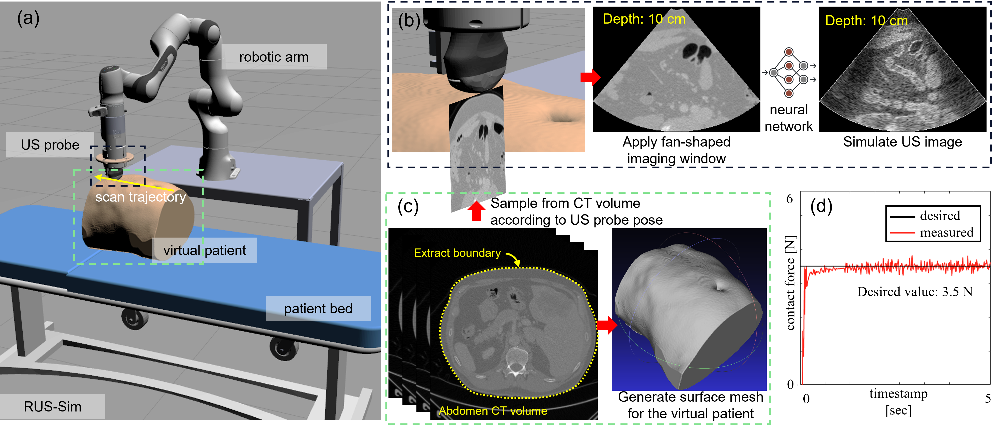
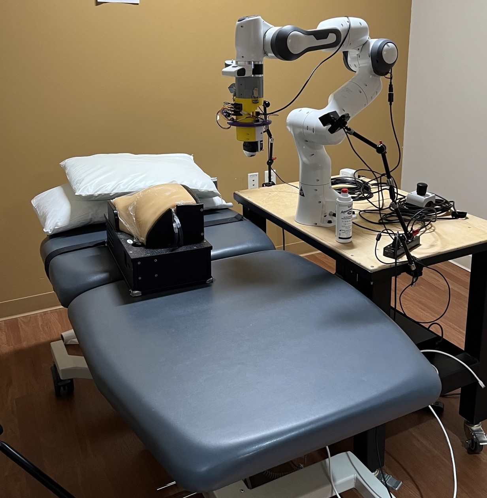

# RUS-Sim 1.0

RUS-Sim 1.0 is a simulation developed specifically for robotic ultrasound imaging applications. RUS-Sim features real-time ultrasound simulation based on preoperative CT scans. This allows simulating ultrasound image acquisition, real-time image processing, image-based robot control, and many more.




RUS-Sim is implemented to streamline the development of many autonomous functionalities on the real robotic ultrasound system (see pic. below), developed by [Medical FUSIONLAB](https://wp.wpi.edu/medicalfusionlab) at Worcester Polytechnic Insitute. For example, the [active-sensing end-effector](https://ieeexplore.ieee.org/abstract/document/9932673) that allows real-time adjustment of the probe orientation; the [standardized imaging plane navigation framework](https://arxiv.org/abs/2406.11523) that servos the probe to the desired location using ultrasound image feedback, etc. 



## 1. Usage

RUS-Sim 1.0 is developed based on ```ROS1```. It was tested on ```ROS noetic``` and ```Gazebo11```.

### 1.1 Dependencies
0. ROS Noetic [installation guide](https://wiki.ros.org/noetic/Installation/Ubuntu)
1. python modules
    ```
    torch==1.13.1+cu116
    torchaudio==0.13.1+cu116
    torchvision==0.14.1+cu116
    numpy==1.23.5
    opencv-python==4.7.0.72
    tqdm==4.64.1
    elasticdeform==0.5.0
    scikit-image==0.20.0
    scikit-learn==1.2.1
    scipy==1.9.1
    Pillow==9.4.0
    ```
2. libfranka 0.10.0 [installation guide](https://frankaemika.github.io/docs/installation_linux.html#)
3. franka_ros 0.10.0 [installation guide](https://frankaemika.github.io/docs/installation_linux.html#)
4. Gazebo11 [installation guide](https://classic.gazebosim.org/tutorials?tut=install_ubuntu&cat=install#Defaultinstallation:one-liner)

### 1.2 Installation 
1. Clone the repository to the ```src``` folder of a ```catkin``` workspace.
2. Download the pretrained CT2US [model files](https://zenodo.org/records/14750861) and place them under ```ct2us/im2im/model```. You may need to create a ```model``` folder first.
3. Build the ```catkin``` workspace
    ``` shell
    catkin_make
    ```

### 1.3 Functionalities

#### 1.3.1 Simulated robotic ultrasound system inside Gazebo
- Launch the Gazebo simulation with the ultrasound robot and a virtual patient
  ```shell
  roslaunch rus_sim rus_sim.launch
  ```
- The robot can be controlled by a hapitic device. For example: https://github.com/MXHsj/ros_geomagic_touch_hid. To enable tele-operative control of the arm:
  ```
  roslaunch rus_sim teleop_haptics.launch
  ```
- The ultrasound image simulation feature can be actiavted by:
  ```
  roslaunch rus_sim sim_us_from_ct.launch
  ```

#### 1.3.2 Simulated ultrasound images from CT slices
This is a stand-alone feature and does not require ```ROS``` and ```Gazebo```. However, cuda environment is necessary. The notebook ```simulate_us_from_ct.ipynb``` shows an example of loading a CT slice and converting it into an ultrasound-alike image.

## Citation
Please consider citing our work if you find rus-sim useful.
```
@INPROCEEDINGS{10794015,
  author={Ma, Xihan and Zhetpissov, Yernar and Zhang, Haichong K.},
  booktitle={2024 IEEE Ultrasonics, Ferroelectrics, and Frequency Control Joint Symposium (UFFC-JS)}, 
  title={RUS-Sim: A Robotic Ultrasound Simulator Modeling Patient-Robot Interaction and Real-Time Image Acquisition}, 
  year={2024},
  volume={},
  number={},
  pages={1-4},
  keywords={Ultrasonic imaging;Computed tomography;Imaging;Real-time systems;Acoustics;Trajectory;Force control;Robots;Frequency control;Ultrasound Imaging;Medical Robots;Robotic Ultrasound Systems;Ultrasound Simulation},
  doi={10.1109/UFFC-JS60046.2024.10794015}}
```
